# User Manual

# Main Interface of MetaPro


# Framework of MetaPro


# Demo website

[http://47.88.77.176](http://47.88.77.176)​

# 1 General Information

## 1.1 Scope of MetaPro Software

Currently high-resolution mass spectrometry instruments are widely used in metabolomics studies, but software in this filed usually have a lack of easily executed quality control and spectra management abilities. Besides, collaboration inconvenience on data processing also restrict analysis on efficiency.

## 1.2 Computer System Requirements

MetaPro is available for Windows 7(or above), Linux and MacOS. The minimum and recommended system specifications for single-node deployment are described in Table 1.

|Specifications|Minumum|Recommended|
|---|---|---|
|CPU|Intel Core i5 10-gen or AMD R5|Intel Core i9 12-gen or AMD R9 5900|
|Hard drive|50GB free space|2x data set size|
|RAM|16GB|64GB(Core i9-10gen), 128GB(Core i9-12gen)|


Table 1. single-node deployment requirements

the multi-nodes deployment requirements are described in Table 2.

|Server Requirements|Deploy software|
|---|---|
|Core i7-10gen, 32GB RAM, 5TB SSD|MongoDB(Main Node), Redis|
|Core i7-10gen, 32GB RAM, 5TB SSD|MongoDB(Child Node, optional)|
|NAS(such as Synology RS2821), 100TB HDD|Data Repository|
|Core i9-12gen, 128GB RAM, 500GB SSD|MetaPro(Core computing node)|
|Core i7-10gen, 16GB RAM, 100GB HDD|AirdPro(Data Conversion)|


Table 2. multi-nodes deployment requirements recommended


## 1.3 Acquisition Method and Vendor File Conversion

MetaPro supports for DDA data acquisition mode. Due to the need to support the whole platform of mass spectrometry file processing, we use a self-developed Computing-Oriented high compression data format-Aird. That means users should convert the vendor file to the aird format files using AirdPro. AirdPro supports the vendor files including .raw,  .wiff and .d formats.
Aird Paper link: [https://www.biorxiv.org/content/10.1101/2020.10.14.338921v1](https://www.biorxiv.org/content/10.1101/2020.10.14.338921v1)

## 1.4 Code Available

AirdPro: [https://github.com/CSi-Studio/AirdPro](https://github.com/CSi-Studio/AirdPro/releases)
AirdPro 1.1
MetaPro: [https://github.com/CSi-Studio/MetaPro](https://github.com/CSi-Studio/MetaPro)

# 2 Getting Started

## 2.1 Associated software

MetaPro depend on the database and basic software below. All dependencies are free to use.


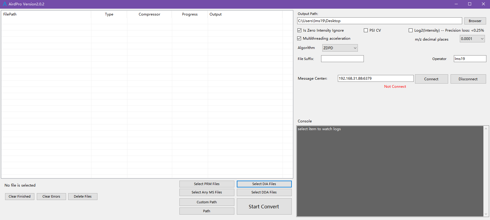

## 2.2 Deployment

#### For windows/mac/linux users

Download the Zip setup file and unzip the file to the recommended disk which has an enough disk space.

## 2.3 Configuration

### 2.3.1 MetaPro

User can edit the configuration file "application.properties" under the "libs" directory

|Properties|Default|Comments|
|---|---|---|
|spring.data.mongodb.port|27017|default port for mongodb|
|spring.data.mongodb.database|metapro|default collection name for mongodb|
|spring.data.mongodb.host|127.0.0.1|default IP for mongodb|
|repository|/root/metaProData|set your aird data repository location.Like /root/metaProData|
|spring.redis.host|127.0.0.1|default IP for redis|
|spring.redis.port|6379|default Port for redis|
|spring.redis.database|0|default db for redis|
|spring.redis.password|||
|no password as default|||


# 3 How to use MetaPro

## 3.1 System conception description

In MetaPro, we provide these main database modules: experiment, compound, method, library, overview, project, spectra, task. The following table illustrates the definition of each module.
Experiment: An experiment is a basic analytical unit in the MetaPro. It represents the mass spectrometry data obtained from one sample. The actual storage mode of an experiment is an Aird format file under the user-defined document folder. A few experiments can be divided into one batch.
Project: A project can have a few batches. Each batch has a few experiments. Project is the largest unit where experiments could be organized.
Compound: A compound refers to a specific metabolite whose name, ID, m/z, retention time(RT) and other information will be stored in the database. Selected compounds could be used for conduct targeted analysis.
Method: All parameters used in the analysis steps are extracted into a method. Different parameters composition could be saved into different methods.
Library: A library contains a few compounds.
Overview: An overview is the storage of the analyzed results. By checking a overview, multiple quality control operations can be achieved.
Spectra: A spectrum is correlated to a specific compound. Instrument type, collision energy, ionization mode and other description information of the mass spectrometry characteristicsare stored in a spectrum.
Task: Task refers to a metabolomics analysis process needed to be done or undertaken. It’s timely status and records could be seen in the task page. Currently, three work templates are available in the MetaPro.

## 3.2 Project management page

This is the first page that users will see when they login in the system. Users can create new projects by clicking on the button in the top column. Then, inputting the name, owner, and description information of the new project on this page, where delete, update and search options are also available. The project management page shows all the users’ projects and their additional information, including batch numbers, experiment numbers, overview numbers, owner and create date.
To add experimental files into a project, users need to categorize all the Aird files into a folder having the same name with the created project. Subsequently, these Aird files can be read into the system through clicking on the "scan file" button. At that moment, their  brief information will be stored. Meanwhile, batch number and experiment number are automatically modified according to the actual number. Also, Users can check extracted ion chromatogram (EIC) in each experiment after the index is created in the system.
Clicking on the selected project will get access to its detailed information page, where its experiments information are fully displayed. Here, the experiment information is able to be updated, deleted, and modified on the same page.
​

## 3.3 Library management page

This page has the similar visualization hierarchical to the project management page. Creating, updating, modifying, deleting options toward compound libraries are comparable to the operations mentioned above. When creating a new library, MetaPro allows users to upload a formatted CSV file to fill the compounds information in this library. Clicking a library means checking all the compounds that are included in this library.
​

## 3.4 Method management page

The contents shown here are the extracted parameters, which we call methods. In the system, the default parameters have been preset to generate a default method. Noteworthy, each parameter can be modified to generate a new method, which could be widely used for multiple projects, batches and experiments to minimize the time cost whenever users find the best parameters.
​

## 3.5 Task management page

All the tasks generated in the system could be found here. Currently, three task types are available here: “File Scan” task, “Targeted Analysis” task, and “Untargeted Analysis” task. Each task records its own created date, modified date, status and time consumption for users to review.

## 3.6 How to start a targeted analysis task

Several actions should be taken before starting a targeted analysis task. First, the project parameters should be properly set and all the files under this project should be scanned and indexed. Second, a prepared compounds list of interest needs to be imported as a library into the MetaPro. These compounds information would be useful in the results generation process. Third, a method used for these experiments should be created with proper parameters.
After all procedures mentioned above are completed, users can go to the project management page and find the project they want to analyze. Then, clicking on “Prepare to analyze” will lead the page to the analysis preparation page, where users need to choose batches they are interested in, the library, and the method used for each batch. In the following step, users can click on the "targeted analyze" button to start a task and find its process details printed as a system log on the task management page. Once the status demonstrates that the task is done, users can check results on the quality control (QC) page through the QC inspection entrance found on the project management page.

## 3.7 How to use QC inspection page for targeted analysis

The primary design conception of the MetaPro QC interface is to cover as much information as possible, satisfy the inspection of MSI level-1 confidence, and provide immediate modification operations. Based on other existing metabolomics software, our visualization modules and inspection operations have been optimized in peak picking, spectrum viewing, and manually integrating and so on.
​

In the QC inspection page, users will be able to check the system recommended results. On the left side of the page lies a compounds switch column. Compounds information like ID, m/z, RT are shown and every dimension could be used as the ordering rule for these compounds. Compounds are organized into pages for users to search and check results one by one swiftly. While the right part of the page illustrates the results of the peaks taken for the compound in all samples of a batch. As a result, users can check all the results of a batch at a glance. Moreover, more modules can be found on the right side. The manual integration module allows users to modify the shape of the detected peaks. The Spectrum Viewer module mainly illustrates the quality of the MS1 and MS2 spectra as seen from the peak summit point. The batch peak inspection module let users to mark the results as success, failure and unknown. By doing so, only the approved results will be exported to the report for quantification results.
​

In addition, this happens many times when the user finds that the retention time deviates from the given value. Therefore, we provide a feature called "Recalculate by new RT", which means that the user can recalculate the result if he finds that the peak is far from the expected situation. Besides, users could also change the parameters to recalculate the pick detection results towards one compound. This would be helpful for some specific compounds.

# 4 Step by step instructions

### 4.1 Project

#### Create project

1. First configure `application.properties` 
	```text
	spring.data.mongodb.uri=mongodb://127.0.0.1:27017/metapro
	spring.data.mongodb.auto-index-creation=true
	server.max-http-header-size=1024000
	repository=/root/metaProData
	export=/root/exportData
	spring.cache.type=ehcache
	spring.cache.ehcache.config=classpath:config/ehcache.xml
	spring.redis.database=1
	spring.redis.host=127.0.0.1
	spring.redis.port=6379
	redis.switch=false
	```
	
	- Modify the value of `export`, used to store the exported file
	eg：`/root/exportData`
	- Modify the value of `repository`, used to store the exported file
	For example：`/root/metaProData`
	- For example, the new project is called `TEST`, in`/root/metaProData`, newly built a folder called `TEST` (and the project is the same), enter `TEST`, create a new folder (any name is OK), here is `folder`, then put the `aird` and `json` to `folder`, the entire path is：`/root/metaProData/TEST/folder/`.
		
		
		
	- Open browser, enter`127.0.0.1:8000`, Start using `MetaPro`.
2. Enter project interface, click`Creat Project`,
	`Project Name`, fill in the name of the newly created folder, here is`TEST`,
	`Owner`and`Description`, fill in according to the demand.
3. Click `Scan Files` to scan all Aird format files under the project file
	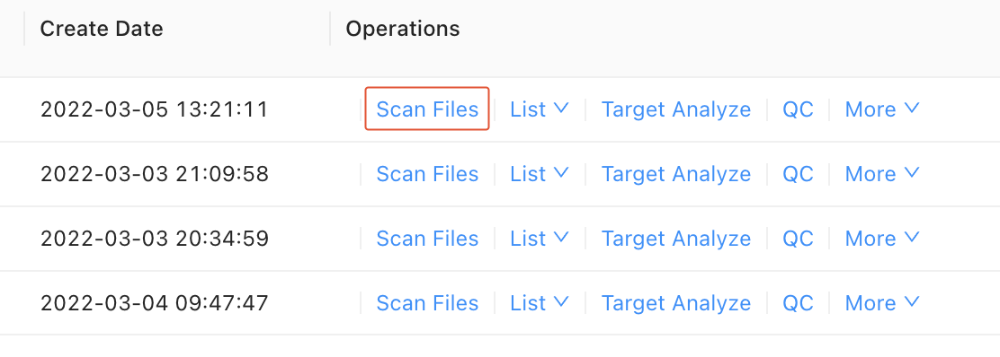
	Scan to a new file will pop up the following prompt box: 
	
	No new file or file is empty, pop up the following prompt box: 
	

   View saved file size: 


---


#### Sample / Overview List

- Sample List
	Click `Sample`, enter Sample List, you can view, search, modify, and delete each Sample
	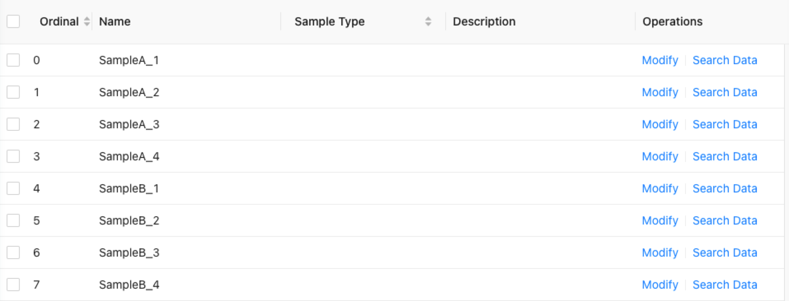
	Click `Search Data`, to enter the RT value, and click Submit, to view the spectra and chromatograms of MS1 and MS2:
	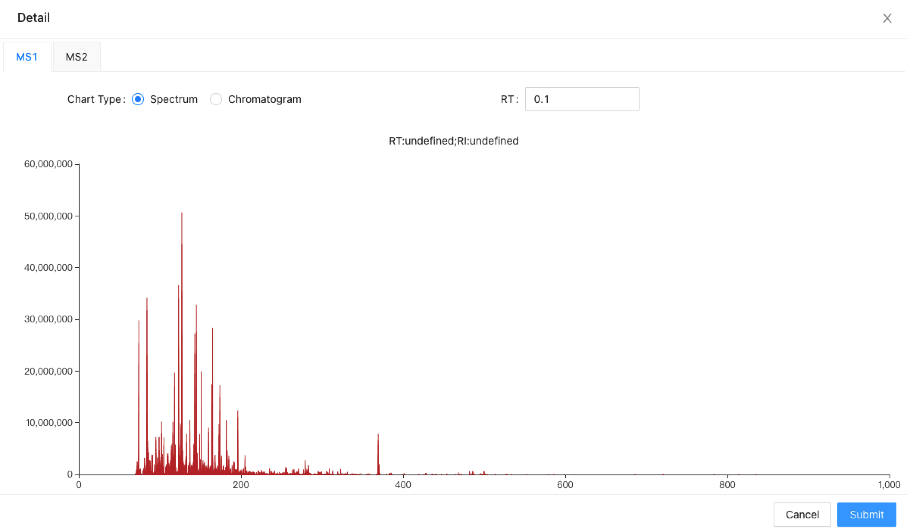
- Overview List
	Enter Overview List, you can view, search, modify, and delete every batch,
	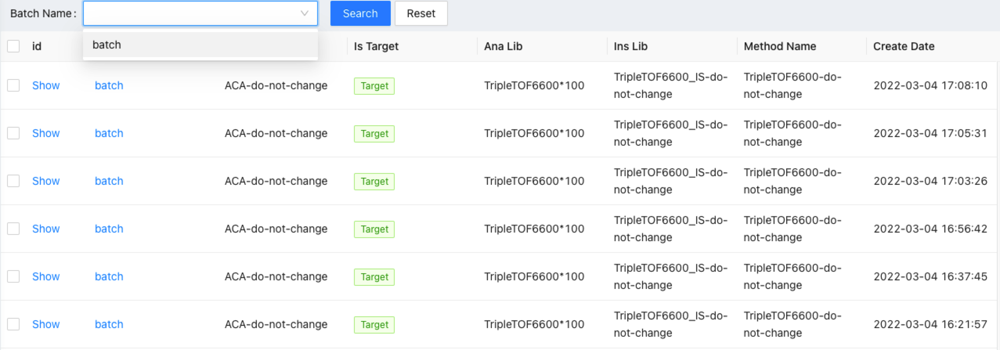
	click`batch name`,show the analysis data of the current batch.
	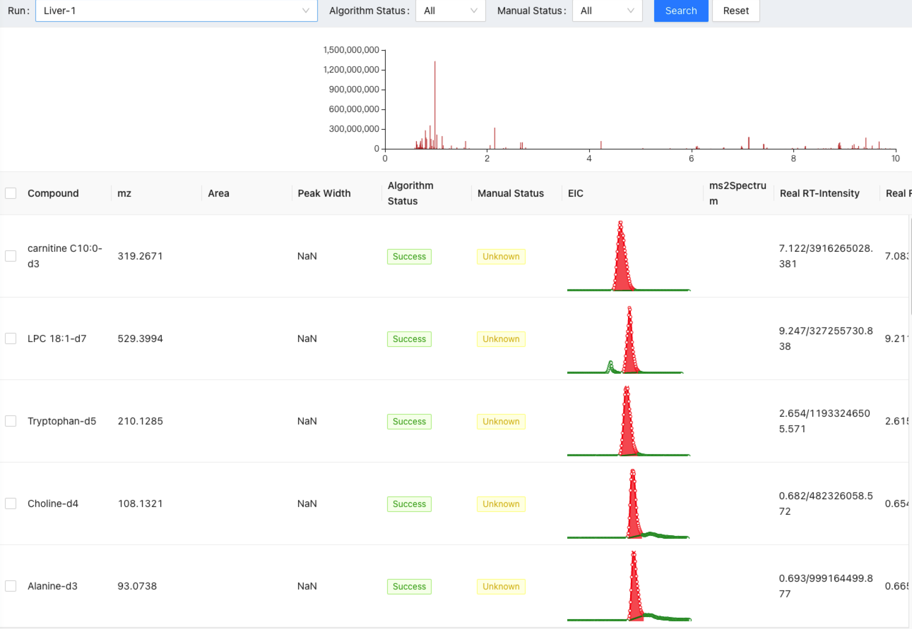

#### Target Analyze

Click `Target Analyze` ,set the method of the current project:

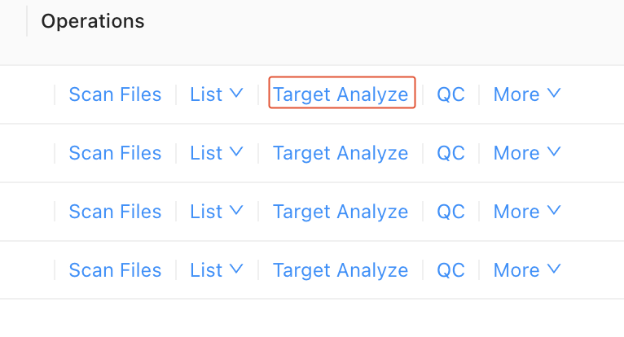

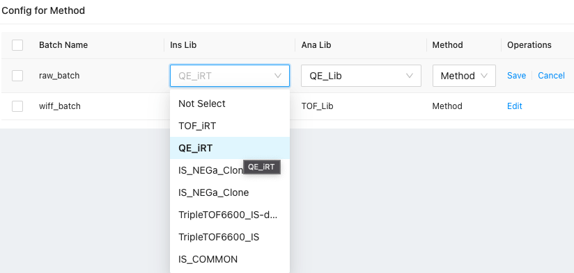

---


#### Batch Quality control inspection interface

This is the main inspection page on samples in a batch. It includes different function modules as labeled.

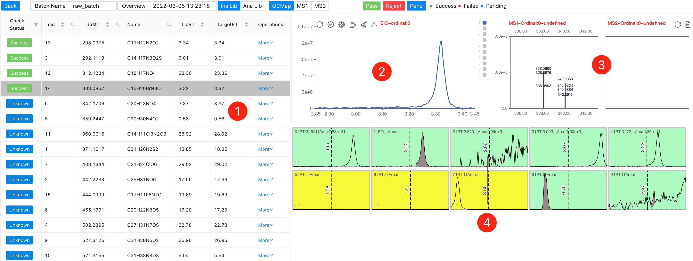

1. Compound switch module
	- `Check Status` represents for the current check status of compounds. It has Success、Failed、Unknow labels.
		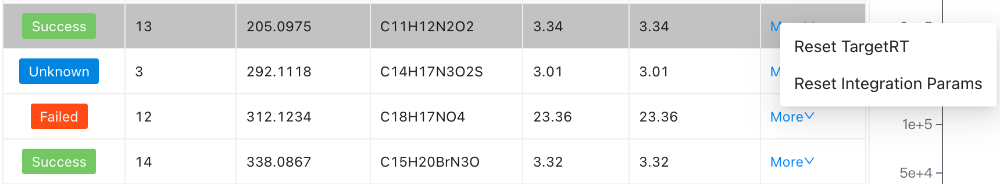
	- Click on the "more", users can `update integration params` and modify RT of a compound.
		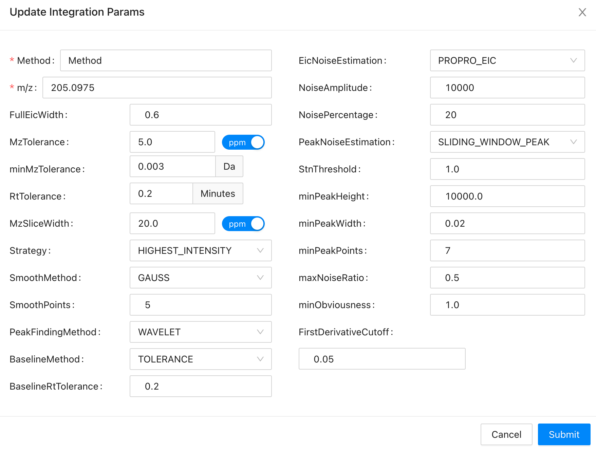
2. Manual inspection mudle
	The buttons on the top are：`Restore`,`Select All/UnSelect`,`Manual Integration`,`Reselect`,`Submit`,`BatchSubmit`
	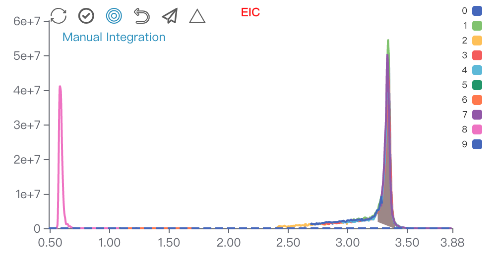
	Click on `Manual Integration`, you can choose two data points to conduct manual integration functions. First left and then right.
	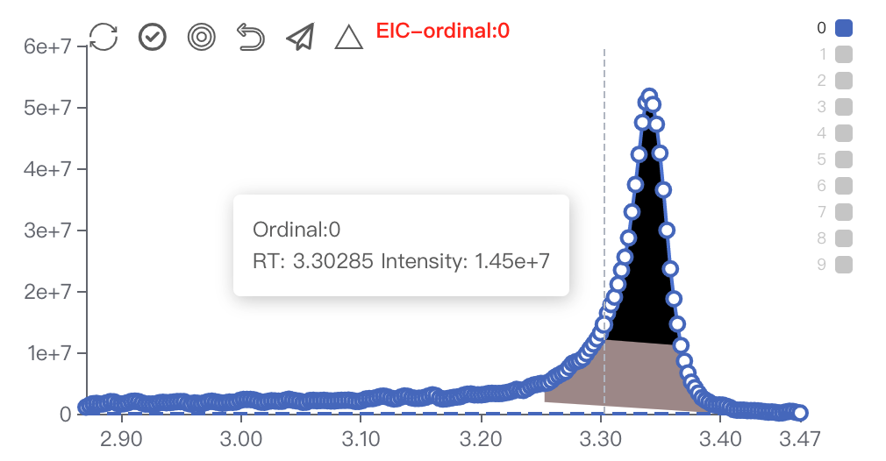
3. Spectrum viewer of `MS1` and `MS2`
	This is changed according to the sample you choose on the batch inspection module.
	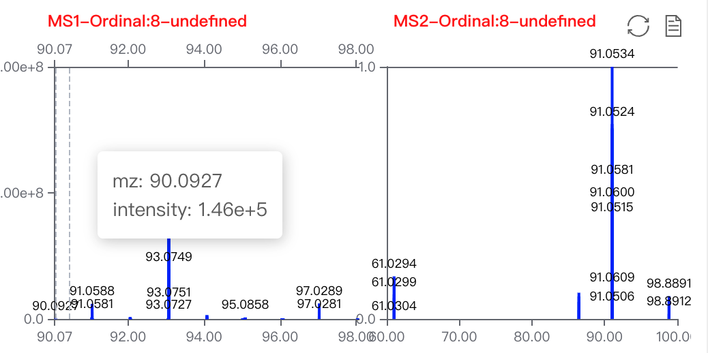
4. Peak shape batch inspection
	Users can choose multi samples to change their status. Red reprensents for rejection. Yellow represents for unknwon. Green represents for pass. The shortcuts are `1`, `2`, `3`.
	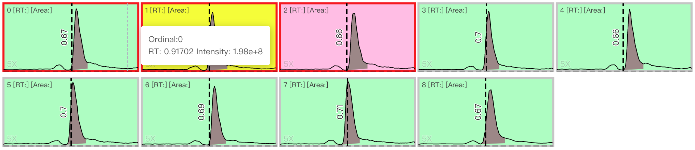

This is the Spectrum viewer towards all the `MS1` and `MS2`. Click on the pointed label to switch pages.

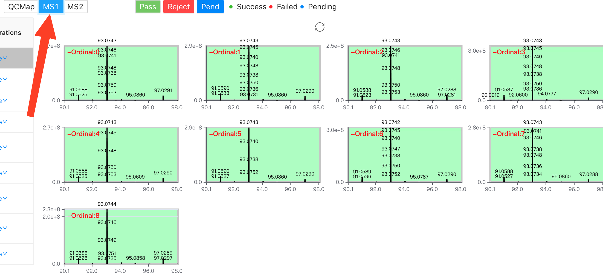

Click on the `Batch Name` or `Overview` buttion could change the current inspection batck or overview.

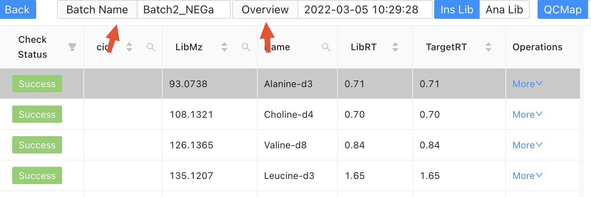

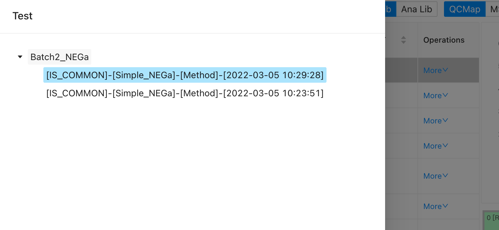

QC interface shortcuts

1. Compound switch module
	1. Arrow keys:  `↑`  `↓` switch componund； `→`  `←` switch page
	2. Control the check status of the current compound, `Space ␣` and `Enter ⏎`: Success, `BackSpace ⌫`: Failed
	3. `Double click `on  each row to change RT value
2. Spectrum viewer
	1. keyboard `1`,`2`, `3`：switch check status
	2. `A`：choose all the samples
	3. `ESC`：cancel check all
3. Manual integration mudule
	1. `Double click`：submit manual integration results
	2.  `R` ：refresh the current page

---


#### Build Library

Choose inspected overview to conduct library curation process on a specific project.

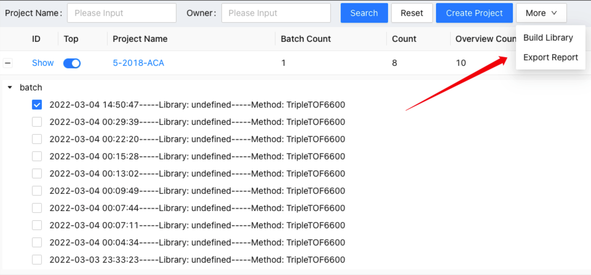

---


#### Export Report

Export report will let users input the output file name towards a specific overview. The quantification results will be exported into the given `.xlsx` file.

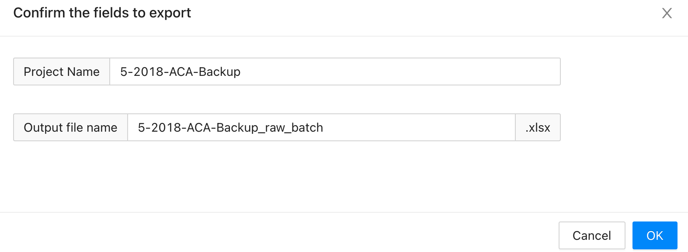

---


### 4.2 Libray

1. Import librar. Click on`Library`，Then click`Create Library`. You will see the following interface. Input a library name and formated file to import local compound library to the system.
	

### 4.3 Method

1. Create Method. First go into the method page, click `create` button. You will see this sheet. The recommended parameters are as follows. You can change these parameters according to your own requirements.
	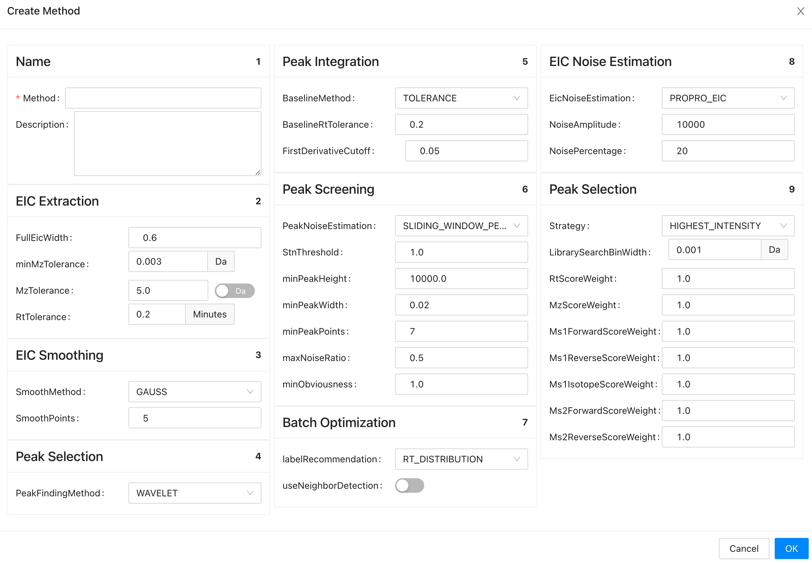
2. Set default. Choose a method and set it to default open stauts. It will be set a default method while analyzing projects.
	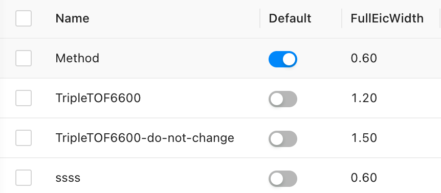

### 4.4 Task 

Task modules conclude：`TARGET_ANALYZE` `BUILD_LIBRARY` `SCAN_AND_UPDATE_EXPERIMENTS`. Other related information can be seen on the page.

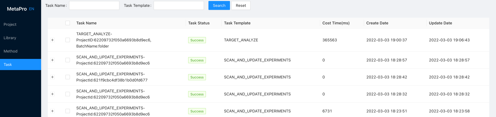


